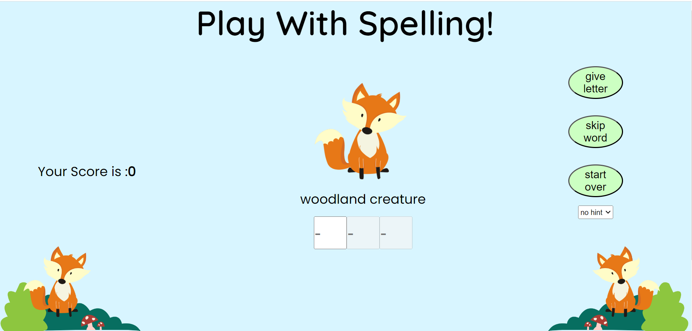
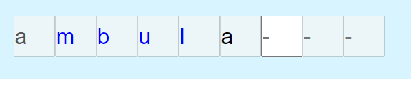

# Spelling game for Children

This spelling game for children was designed so that they can play from an image and description to fill out the letters in the word to boxes. There is also a hint section to let them know what is odd about the spelling of this particular word. This should improve their spelling of difficult or unusual words.


The site can be accessed by this [link](https://rachwalm.github.io/spelling-game/).

## How to play
Once you start the game it will provide you with an image, description and boxes to fill out to spell out the word. There will be one box for each letter and the focus will start on the first letter required. As each letter is typed, if you have the correct letter for spelling the word it will go blue and move you to the next box. Otherwise, the letter will go red and you will have to keep trying till you get the correct letter / request the letter/ skip the word or start over. Score will increment with each correct letter entered by the user. 
When you have completed the word it will provide you with an new image and description for a new word till you have completed all the words or restart. If you complete all the words it will give you a final score.

## User Experience

### Initial Design

#### Scope and Strategy

- The idea is to help children improve the spelling of unusual or particularly difficult to spell words. There are certain conventions or exceptions in English that make the spelling particularly difficult. This is often a long process for children at school and a game that helps them should speed up their learning.

- It is not possible to write the word that they have to spell on the screen or they would just copy it. Therefore, the word will be portrayed using an image and a description. If the user cannot figure out the word or spelling there will be a skip word button to avoid frustration.

- The hint information should help to teach them the rules or exceptions in English spelling that are relevant to that word. Also if unable to spell the word this may give them the information that they require to complete the spelling.

- To make the game competitive (and therefore retain interest - to better ones score) there will be a score per letter that is correct.

- It is out of scope to actually teach children spelling - this is just a fun game to be played on a a computer to aid their learning.

### User Stories

First time users will be able to play a selection of words and test themselves against the selection to see how good they are at spelling and learn some rules and exceptions for new spellings, if they use the hints.

Repeat users may find that they are coming across some of the same words so can feel an achievement at learning these words or completing them more easily or without buying letters a second time. If they didn't complete all the words last time or new ones have been added then they can also do a new selection of words. Eventually becoming proficient at recognising the images and descriptions and knowing the correct spelling.

Repeat users should also get a random order to the words so it shouldn't become repetitive too quickly as they will at least be in a different order to last time.

### Skeleton

- Landing view will contain the general background and title/fox logo at bottom. Also two buttons to either get instructions (instructions and the point of the game information will appear in a pop up box) or to start the game. They can also pick between doing an easy level or hard level.

- Game view will contain the general background and title/fox logo at bottom. Additionally there will be the functionality of the game. This will include relevant image, description, box for each letter of the word and a hint (that can be turned on and off). This screen will also contain a skip word and and restart button as well as a timer (timer feature later decided against after discussion with potential users). As each word is completed the screen will clear of the old word information and be replaced with the next word.

- If you skip the word the game view will be retained with the next word replacing the current display. The skipped word will be saved for if words are run out of or if user just keeps skipping.
- Once you are out of words you go to a final score page.

- If you restart it will check that you want to leave the page and take you back to the beginning, this gives you the opportunity to return to the start of the game.

- If you try to leave the page it will check that is what you intended so you don't loose your score.

## Functions

### Functions Flow Chart

#### Initial Plan for Flow Chart

As I initially proposed my plans to my mentor I provided some images (I was unaware at this time I could do it all on one page) to show my thoughts and intentions:

pages

-[landing page](documents/page1.png)

-[instructions page](documents/page2.png)

-[game page](documents/page3.png)

-[score page](documents/page4.png)

-[thank you page](documents/page5.png)

written thoughts/explanations:

-[explanation](documents/first-thoughts.png)

which lead us to draw up this flow chart:


#### Final Flow Chart

As the development progressed there it evolved to include the below decision tree (overview not every decision, but groups of decisions - like acceptable key pressed?):


There is also features that allow the player to ask for the first letter/buy a letter or see the hint that aren't critical to play that haven't been included in this flow chart to keep it simple.

### Functions to ensure game played correctly

The first function that the user will access will be front screen with the start game and instructions buttons. 

#### Instructions

The instructions button leads to a dialogue box containing all the instructions. This was something that I was unfamiliar with and used the code from this :

[modal vs dialogue blog](https://blog.webdevsimplified.com/2023-04/html-dialog/)

From which I copied the code:

```js 
dialog.addEventListener("click", e => {
  const dialogDimensions = dialog.getBoundingClientRect()
  if (
    e.clientX < dialogDimensions.left ||
    e.clientX > dialogDimensions.right ||
    e.clientY < dialogDimensions.top ||
    e.clientY > dialogDimensions.bottom
  ) {
    dialog.close()
  }
})
```

The rest of the code for the dialogue can also be ascertained from the video included in this blog.

I choose 'showModal()' not just 'show()' so that the rest of the page becomes inert.

CSS code was written to make the backdrop of the page of the dialog slightly opalescent and a darker colour. I liked the opalescence of 0.7 on experimentation.

```css
dialog::backdrop {
    background-color: rgba(176, 226, 245, 0.7);
}
```


#### Buttons activation

All the buttons were activated by click event listener functionality which called the relevant function. For example:

```js
document.getElementById("skip").addEventListener("click", function () {
        skip(); // allows player to skip a word and it will be repeated at the end
```

#### Progression from one view to next

As everything took place within one page index.html it was necessary to to hide and/or use visibility to only have the current things on the page. This was done through a combination of CSS to set things to their original state then make changes at certain points using JavaScript. Anything not required at time of landing was put as hidden and some elements had to have their areas reduced to very small so they didn't affect the positioning of the currently visible material.

```CSS
#gameBox {
    visibility: hidden;
    height: 1px;
}
```

The use of the Javascript 'style.display = "none";' could only be used once the area was not to be used again as it removes the item from the page. So this was done to hide the front page buttons once they were no longer required. Most of this was controlled by the function hideFront and theEnd to move from one layout to the next.

#### Picking which word and the associated information

An important piece of functionality that was decided upon was the use of an array and key pairs to store all the data that the game would require to draw upon:

Use of arrays meant that a lot of the work for finding information could be done either using indexing or the key of the key pair.

So that it would be a different order (not just iterate through the array) each time the user played a random number was generated using:

```JS
function rand() {
    let randomly = Math.floor(Math.random() * wordData.length);
    return randomly;
}
```

This number could then be used to pick from the array at random using indexing.

#### Arrays used

Three arrays are used to hold information once the game has started.
1. wordData - holds the words yet to be used
2. skipped - holds the words that were skipped (therefore incomplete) 
3. guess - holds the letters of the current word that have been correctly guessed.

#### Linking on screen boxes to arrays

It was necessary to write functions to link the index that we wanted to access of the array and the input boxes that were on the screen for the user. These functions were whichBoxNumber (output int), whichBoxInput (output 'input'int as these were the id's of the inputs in HTML), and whichBoxInputMinusOne (output 'input'int to align id's with the correct box at certain points in the code). These function linked the array indexes and text on screen to allow various other functions to operate on the correct bit of code.

#### Keyboard listening events

As keyboard entries had to be manipulated, it was essential to utilise the keyboard events, onkeydown and onkeyup.

In the code institute tutorial the javascript for the onkeyup and onkeydown was put in the html. 

```HTML
<body onkeypress="handleKeys(event);"
        onkeydown="handleKeys(event);"
        onkeyup="handleKeys(event);">
```

As my mentor said that it would be better practise for HTML to contain HTML only and the javascript to be in script.js I moved this functionality to the javascript, although I couldn't find an example on the internet of the syntax so had to experiment. Eventually, I found an example taking onkeyup and onkeydown out of html into Javascript from slack entry on 31st July 2021 AnthonyK in the project-milestone-2 under code institute.

This lead to the addition of the code:

```JS
document.onkeydown = function (e) {
        handleKeys(e); //allows user to enter a letter into the word
    };
    document.onkeyup = function (e) {
        handleKeys(e); //moves letter focus onto the next word
    };
```

#### Use of onKeyDown and onKeyUp

To avoid bugs that would cause the user inconvenience or confusion, it was necessary to eliminate the code accepting the wrong key entries and performing tasks. Therefore the onkeydown was used to assess the key pressed and if correct then the onkeyup would allow the user to progress to the next letter.

The onkeyup and onkeydown functions were inspired by the  Code Institute javascript& the dom > handling DOM events > keyboard events tutorial which included the stop repeat event code used:

```JS
event.preventDefault();
    if (event.repeat) {
        return false;
```

#### Manipulating the DOM by ID

Before any interactivity could be introduced the user interface had be made available, this was done using innerHTML functionality. I was introduced to this functionality in the code institute tutorial JavaScript & the DOM  Manipulating the DOM  Changing Existing Elements. This allows me to add HTML dependent on the information that I was drawing from the array (later .JSON files). In this way I was able to add the image, description and hint connected with the current word.

```JS
let image = ``;
        let des = `<div id="dess"><p>${wordData[pick].decs}</p> </div>`;
        let hinty = `<div id="hintys"><p>${wordData[pick].hint}</p> </div>`;
        currentWord = wordData[pick].word;
        document.getElementById("image").innerHTML += image;
        document.getElementById("description").innerHTML += des;
```

#### Put input boxes relating to letters on screen

An additional function was created to do the input boxes correlated with the letters in the word called buildLetters. This required a for loop associated with each letter. This function also called functions to check if the first letter had been requested or if on a repeat through, what letters had already been inserted, wantedFirstLetter and whatComplete respectively. It also called the function disableArrayBoxes.

empty input


first letter requested


retained letters from skipped word


#### Only allow focused input activity

disableArrayBoxes also used a for loop across the letters in the word but this time to disable the input ability of all but the relevant box and to put focus on the relevant box. In the above examples the top one has focus on the first box, then next the second box and the last the fifth box as they are the next letter required.

The disable input was learnt from [W3](https://www.w3schools.com/jsref/prop_text_disabled.asp).

#### Checking that key pressed was a letter not number, special character etc.

Several functions were used to assess the if the letter was correct. It needed to be a letter or not accepted. Special character, numbers and other keys needed to be avoided. 'lettersOnly' checks if the key relates to a letter, this was adapted from [W3 code to take letter only from](https://www.w3resource.com/javascript/form/all-letters-field.php#:~:text=You%20can%20write%20a%20JavaScript,HTML%20form%20contains%20only%20letters.&text=To%20get%20a%20string%20contains,%2F). This allowed me to identify '/^[A-Za-z]+$/'. If it did not fall into that range then an alert was raised in handleKeys. 


However, this still left several keys that could be activated and put into the input such as tab and shift. So additionally the functionality lettersNotInput was created using two functions, getModifierState and keycodes to avoid those keys giving superfluous information.

```JS
function lettersNotInput(typed) {
    let shift = typed.getModifierState("Shift");
```

```JS
if (typed.keyCode < 58) {
        return true;
```

#### Uppercase turned to lowercase

Users also might use upper case letters when typing. But the key pair of word was in lower case. So to solve this problem and make it look nicer and easier to read, the letters were going to be fed in as lower case irrespective of which case they were originally in.

This was easily done with function lowerCase:

```JS
function lowerCase(letter) {
    let lower = letter.toLowerCase();
    return lower;
}

```

#### Guess array comparison to word spelling

Now we needed to take the input letter that had been process through the above functions to leave it as only a lowercase letter. This could be done by putting the letter into the guess array and then comparing the guess to the corresponding letter in currentWord variable. 

```JS
let isCorrect = guess[whichNumber] === currentWord[whichNumber];
```

the outcome of this then needed to be fed back to the user. A colour system was decided upon, initially it was to be red and green, but upon discovering that it would not be a good colour combination for colour blind people this was changed to red and blue. Red for incorrect and blue for correct.


Another signal to people who couldn't distinguish the colour is that it would only move/focus to the next letter through the moveOn function which decided where to disable the inputs and focus the letter. If the letter was incorrect it was also removed from the guess by pop. This meant the wrong letter wasn't retained for future use. From the above example you can see that the focus remains on the wrong 'c' letter.

The moveOn function had two options either to move to the next letter or if all the letters in the word had been correctly guessed then it removed the word from the wordData array so it wouldn't be recalled again using splice and called the clearRestart function to clear the user interface.

#### Set up for next word

clearRestart function just called the empty function and the buildGameArea function to start the next word.

#### Clear screen for next word

It is the empty function that uses the DOM remove child to take all the HTML added earlier by Javascript away so it is back to the screen that it was at when the game was started and the new word can be built. It also emptied the guess array so that started fresh for the new word.

```JS
function empty() {
    const emptyImage = document.getElementById("image");
    emptyImage.removeChild(empimg.firstElementChild);
    const empDesc = document.getElementById("description");
    empDesc.removeChild(empDesc.firstElementChild);
    const letterRemove = document.getElementById("actualGame");
    for (let i = 0; i < currentWord.length; i++) {
        letterRemove.removeChild(letterRemove.firstElementChild);
    }
    const emptyHint = document.getElementById("hints");
    emptyHint.removeChild(emptyHint.firstElementChild);
    guess = [];
}
```

#### Score

The next features that help to improve engagement and interest of the user are the scores and finalScore. These used a global variable to hold the score and then .innerHTML to include it on the screen. They were separate functions as scores also incremented the score.


#### Skip

To avoid frustration of a player that can't guess a word the skip function was added. This allows the player to move to another word without completing all/any or the letters. To avoid running out of words quickly the words are then kept in a separate array to allow them to be run through when the original wordData array has been complete. 

This means that during the skip operation it is essential to record the letters that the user has already guessed (if any), to avoid them getting additional score for the letters being put in again and avoid the annoyance of retyping them. As the letters are stored in a guess array during the word this is transferred to complete. Luckily this only required a shallow copy so was simpler than adding the .JSON information as the array could just be added to wordData.complete array.key. 


#### Give letter

Also to make the game less irritating when stuck a give letter function was devised. Initially the plan was to decrease the score when buying a letter but this was found to be demotivating by the children I talked to so you just don't get a score increment for buying the letter. This function uses the length of the letters in the guess array to say which index is required to take the letter from the word, then inputs it in the screen box and guess array. The colour for these letters was decided as black as a neutral colour but still showed visibly that they hadn't got it right.



In this example the first letter had been ticked so that is black as receives not score and the blue letters are correct, then the last 'a' is black as it has been requested not provided by the user.

#### event listeners for interactivity

Both skip and give a letter were initiated by Eventlisteners for their relevant buttons identified by ID.

Lots of people on first glance at the game said that they wanted the first letter of the word to already be in place when the user was presented with the information about the word. This was done by putting a dropdown select on the landing page and event listener for that. This then created a constant which was a boolean as wantFirstLetter, then on the calling of the function to set up for a new game this boolean could be checked by the function booFirstLetter and set for the rest of the game. Then at the end of the function building the input boxes on screen the wantedFirstLetter consults the boolean and if required using input0 as the first letter box adds the letter and it is added to the guess array to align all the indexes. The focus and disabled text boxes function disableArrayBoxes puts the first focus on the second box.

#### End and score

When the game was in development the idea was to send the user to another finish page when they had run out of words or if they quit through the javascript :

```JS
window.location.replace("http://www.w3schools.com");
```

this code above was taken from [W3](https://www.w3schools.com/howto/howto_js_redirect_webpage.asp#:~:text=There%20are%20a%20couple%20of%20ways%20to%20redirect,%3D%20%22http%3A%2F%2Fwww.w3schools.com%22%3B%20%2F%2F%20Simulate%20an%20HTTP%20redirect%3A%20window.location.replace%28%22http%3A%2F%2Fwww.w3schools.com%22%29%3B)


 but to do this proved less efficient and time consuming in an unanticipated way. So the following page was designed within the index page.

 

#### onbeforeunload alert

A final feature was to warn the user before they left the page as this would incur them loosing their score. This functionality was adapted from [W3](https://www.w3schools.com/jsref/event_onbeforeunload.asp) to give alert when someone tries to leave the site.

```JS
window.onbeforeunload = function (event) {
    event.returnValue = "leaving site";
};
```


## Features

### Colour Design

The colour scheme was created to be gentle with clear bright colours where actions was required such as buttons. It was supposed to be reminiscent of the sky as we has a fox woodland at the bottom. the BOE2F5 needed to be changed to rgba so that we could introduce a certain amount of opalescence (rgba = 176, 226, 245, 0.7).


It was also decided that for accessibility of colour blind users it would be worth changing the initial idea of red and green as the colours that the letters changed when incorrect or correct, to red and blue. These colours are more distinguishable for people with certain colour blind conditions.

### Font

For the font Poppins was chosen for the bulk of the text with Quicksand being chosen for the title.

The title using Quicksand is a slightly rounder font which is similar to a lot of fonts used in a lot material aimed at children. The Poppins as choice for the bulk of it is extremely simple as a font to make it easy to read for children without any serif or handwriting or gothic styling that could be difficult and therefore detract from a child's experience.

## Future improvements

There are several future improvements that should be recommended if there was unlimited time to continue with this project.

There are a couple of code efficiencies:

1. Instead of having the first letter in it's own key pair in the wordData function it could be done by indexing the actual "word", rather than "firstLetter".
```JS
let wordData = [{
    "word": "fox", // word
    "image": "src='assets/images/fox.png' alt'cartoon incense'", //source and alt for image
    "decs": "woodland creature", //description
    "hint": "x sounds like s", //hint
    "complete": [], //array for guessed letters if skipped
    "firstLetter": ["f"] // first letter for if requested
}]
```

2. Figure out which buttons the various functions that ensure it is only a letter not other key do and reduce the number of functions. Currently, lettersOnly and lettersNotInput are doing different parts of the same thing.

3. As the letter goes into the guess array when it is typed at the moment then is removed if it is wrong, an efficiency would be to reorder the functions in such a way as it checked first then it needn't enter the guess array.

Improvements in user experience:

- Provide the description and the hint read audibly so that people who have difficulty visually can also use the game.

- Have a name input so that the user can be referred to by name later on.

- Currently the word instantly disappears so you move to the next word and never actually see the final letter. It might be nice to have a slight delay so the whole word can be seen, especially if the user has requested the last letter as they can't guess it.

- start over button could go through the score screen so you get the feeling of finishing.

- Although the timer idea was fairly universally disliked, it could be put as an option which people can switch on if they want to go against the clock.

Extension of the game:

1. Include more words.
2. Include levels which you complete to go to the next.
3. Themed lists

## Development Bugs

### Array indexing

Most development bugs centered around getting the indexing matching up to the correct box or point required by the code. Often the wrong letter or word was being used. As I was only using five words this was usually very easy to rectify by counting letters in words and subtracting 1 from the index number etc.

### Styling layout

With the CSS it took some time to get all the boxes where I wanted them, especially as I was unfamiliar with the things that were invisible taking space this took me some time. Also dealing with flex box growing and shrinking leaving 'usable' but not used space around the box giving purple areas on the chrome inspect function. The invisible areas was solved by making the boxes extremely small until required then setting them back to suitable areas. The purple box issue was solved by adding extra divs to provide containers for the boxes I was using.

### Only allow letters

Having non-letter characters display took some time, and may now have excess functions, but each function only dealt with some of the keys as I built them up. I don't feel that at this point there is value to experimenting with how to decrease the number of functions for efficiency as it works and time is limited (could be improved in the future).

### Giving wrong letter when using give letter function

There were a couple of times during development when the letters that were being input in the box were not the ones that were intended. This was found to either be because the letter was one out on the indexing between the box number and the current word, or that data was being read from the wordData array instead of the currentWord variable. This was solved by either correcting the indexing for the ones where that was the problem. For the ones that were reading the array or current word at the wrong point, it was either necessary to change which variable was being read or change when the current word was taken from the array so that they each contained the correct information when the functions were called.

### Showing old letters not most recent key press

Another problem was that as the input was set to only have a max length of 1, the first letter typed was the one that went into the box and then whatever came after that wasn't shown. This was rectified with the function lettersInput.

```JS
function lettersInput(typed) {
    document.getElementById(whichBoxInput()).value = typed;
}
```
This put the letter in that had most recently been typed so that the user could see what was being typed and the outcome.

### Array cloning

Something that provided a very interesting solution was cloning arrays. I was unaware of the difference between a shallow copy and a deep copy. Therefore, my initial attempts to just make one array 'equal' another were not producing what I expected. Therefore, I looked at a lot of information and tried these solutions.

The initial functionality that I experimented with were concat, object assign, array.map, array.from, spread operator and push etc. This does not work well with nested objects. These suggestions were adapted from [geeksforgeeks](https://www.geeksforgeeks.org/how-to-clone-an-array-in-javascript/).

```JS
let addOld = JSON.parse(JSON.stringify(wordData.splice((pick), 1)));
```

I learnt about the difference between shallow and deep cloning from [youtube](https://www.youtube.com/watch?v=E3dboLSBeJc), which explains that it is a memory address copy when you just use equals sign.

The solution for the skip function required a deep clone and from watching [youtube](https://www.youtube.com/shorts/XK0V0E3bA-M) a built in function in Javascript called structuredClone seemed to provide the best functionality.

```JS
function skip() {
    let addOld = structuredClone(wordData[pick]); //deep copy
    guessToComplete(addOld);
    skipped.push(guessToComplete(addOld)); //adds word to skipped array for later
    wordData.splice((pick), 1); //removes word from current array
    clearRestart(); //sets up for next word
}
```

## Responsive

The google chrome responsive viewer was used to gain images of the front page efficiently, but on game play pages this got stuck in an infinite loop. Also it would not be realistic to do each word of game play in this section so the first page will have many examples then a few words and sizes will be picked for the remaining pages.

### Landing

- [Galaxy-S9-Note-8-S8](documents/Galaxy-S9-Note-8-S8-360x740.png)
- [Galaxy-S9-Plus-S8-Plus](documents/Galaxy-S9-Plus-S8-Plus-412x846.png)
- [ipad-Mini](documents/iPad-Mini-768x1024.png)
- [ipad-Pro](documents/iPad-Pro-(12.9-inch)-1024x1366.png)
- [iphone-XR](documents/iPhone-XR-XS-Max-414x896.png)
- [iphone-XS](documents/iPhone-XS-X-375x812.png)
- [laptop1](documents/Laptop-1-1440x900.png)
- [laptop2](documents/Laptop-2-1280x800.png)
- [laptop3](documents/Laptop-3-1280x950.png)
- [large-monitor](documents/Large-monitor-1920x1080.png)
- [large-screen](documents/Large-Screen-688x1031.png)
- [medium-screen](documents/Medium-Screen-1024x800.png)
- [Pixel-3](documents/Pixel-3-3-XL-393x786.png)

### Instructions

## Testing

For testing, validators and accessibility see [Testing](TESTING.md)

### Unsolved Bugs

As this game is based on keyboard events, it may not work properly without a physical keyboard. Onscreen keyboards might cause problems. Sometimes people using onscreen keyboards didn't get it registered on the first push. This game was designed to be used on a keyboard, so this is not in the scope of the project. As this was only discovered during the testing by external testers on their own devices the time to complete a rectification of this was not available.

All other detected bugs were solved.

### Human Errors

Many spelling mistakes, all rectified.

Due to unfamiliarity with some of the syntax and functions that are available, there was a great deal of experimentation that took place to get the correct function or syntax that output my anticipated results.

One error that required the assistance of the tutors at code institute was that an event listener was calling 'handleKeys' function where it appeared that an input was occurring twice. After watching many tutorials and trying various fixes nothing worked when I changed the function. The tutor quickly spotted I was calling the function in the handleKeys function and right at the top of the code when I was calling the 'handleKeys' function. Unfortunately, I had got too focused on the function to look at whole code. This is a learning experience to take a look at the whole process, not just what you are currently doing.

## Deployment to Github

The site was deployed to GitHub pages. It was deployed by the following actions:

1. In the git hub repository, the settings tab was selected.
2. 'Pages' was selected from the left hand side menu.
3. Under Build and deployment Source section had 'Deploy from Branch' and the 'main' branch was selected.
4. Save was selected.

Here is the link https://rachwalm.github.io/spelling-game/ to the deployed page.

### Local deployment

1. In the git hub repository, code button clicked
2. clicked local
3. choose HTTPS
4. link copied
5. went to terminal (version control) and input the following :git clone https://github.com/RachWalm/spelling-game.git

The project was cloned.

## Array of words

### Initial development array - five words only

The key pairs are :

- word: the word to be spelt
- image: the source and alt for the image to be displayed in HTML
- decs: description to be provided to the user to help them guess the word
- hint: if hint requested how the spelling is interesting
- complete: if viewing the word for the first time it is empty, but if it has been skipped then the letters in complete have been put in from the guess array and ar pre-populated so they can't score twice and don't have the frustration of redoing work.
- firstLetter: if they have requested the the first letter of each word is pre-populated it is taken from here.

```JS
let wordData = [{
        'word': 'elephant',
        'image': 'src="assets/images/elephant.png" alt"cartoon elephant"',
        'decs': 'large animal often found in Africa or Asia',
        'hint': 'f and ph often sound the same',
        'complete': [],
        'firstLetter': ['e']
    },
    {
        'word': 'station',
        'image': 'src="assets/images/station.png" alt"cartoon station"',
        'decs': 'place where trains or buses stop for passengers',
        'hint': 'tion sounds like shun',
        'complete': [],
        'firstLetter': ['s']
    },
    {
        'word': 'pharaoh',
        'image': 'src="assets/images/pharoah.png" alt"cartoon pharoah"',
        'decs': 'egyptian king',
        'hint': 'f and ph often sound the same',
        'complete': [],
        'firstLetter': ['p']
    },
    {
        'word': 'quarter',
        'image': 'src="assets/images/quarter.png" alt"cartoon quarter pie chart"',
        'decs': '1/4 of something',
        'hint': 'q usually has a u after it',
        'complete': [],
        'firstLetter': ['q']
    },
    {
        'word': 'incense',
        'image': 'src="assets/images/incense.png" alt"cartoon incense"',
        'decs': 'burnt to give a smell',
        'hint': 's and c are difficult to place in this word',
        'complete': [],
        'firstLetter': ['i']
    },
];
```
## Images

### Image sites

- [Pixabay](https://pixabay.com/)
- [freepnglogos](https://www.freepnglogos.com/)

The above array was generated from my head and the images are:

- [elephant](https://pixabay.com/vectors/elephant-animal-jungle-savannah-1598359/) (Image by <a href="https://pixabay.com/users/andremsantana-61090/?utm_source=link-attribution&utm_medium=referral&utm_campaign=image&utm_content=1598359">André Santana AndreMS</a> from <a href="https://pixabay.com//?utm_source=link-attribution&utm_medium=referral&utm_campaign=image&utm_content=1598359">Pixabay</a>)

- [station](https://pixabay.com/vectors/clock-departure-destination-display-1293899/) (Image by <a href="https://pixabay.com/users/openclipart-vectors-30363/?utm_source=link-attribution&utm_medium=referral&utm_campaign=image&utm_content=1293899">OpenClipart-Vectors</a> from <a href="https://pixabay.com//?utm_source=link-attribution&utm_medium=referral&utm_campaign=image&utm_content=1293899">Pixabay</a>)

- [pharaoh](https://pixabay.com/vectors/egyptian-egypt-ancient-historic-311457/) (Image by <a href="https://pixabay.com/users/clker-free-vector-images-3736/?utm_source=link-attribution&utm_medium=referral&utm_campaign=image&utm_content=311457">Clker-Free-Vector-Images</a> from <a href="https://pixabay.com//?utm_source=link-attribution&utm_medium=referral&utm_campaign=image&utm_content=311457">Pixabay</a>)

- [quarter](https://pixabay.com/vectors/pie-chart-icon-data-chart-7128354/) (Image by <a href="https://pixabay.com/users/krzysztof-m-1363864/?utm_source=link-attribution&utm_medium=referral&utm_campaign=image&utm_content=7128354">krzysztof-m</a> from <a href="https://pixabay.com//?utm_source=link-attribution&utm_medium=referral&utm_campaign=image&utm_content=7128354">Pixabay</a>)

- [incense](https://pixabay.com/vectors/pie-chart-icon-data-chart-7128354/) (Image by <a href="https://pixabay.com/users/20259794-20259794/?utm_source=link-attribution&utm_medium=referral&utm_campaign=image&utm_content=7790187">nuri gogoi</a> from <a href="https://pixabay.com//?utm_source=link-attribution&utm_medium=referral&utm_campaign=image&utm_content=7790187">Pixabay</a>)

Now additional word could be put in the game.

- [dinosaur](https://www.freepnglogos.com/images/dinosaur-18676.html) (<a href="https://www.freepnglogos.com/pics/dinosaur">Dinosaur from freepnglogos.com</a>)

- [giraffe](https://www.freepnglogos.com/images/giraffe-24961.html) (<a href="https://www.freepnglogos.com/pics/giraffe">Giraffe from freepnglogos.com</a>)

- [butterfly](https://www.freepnglogos.com/images/butterfly-10115.html) (<a href="https://www.freepnglogos.com/pics/butterfly">Butterfly from freepnglogos.com</a>)

- [cucumber](https://www.freepnglogos.com/images/cucumber-26791.html) (<a href="https://www.freepnglogos.com/pics/cucumber">Cucumber from freepnglogos.com</a>)

- [astronaut](https://www.freepnglogos.com/images/astronaut-24400.html) (<a href="https://www.freepnglogos.com/pics/astronaut">Astronaut from freepnglogos.com</a>)

- [ambulance](https://www.freepnglogos.com/images/ambulance-35597.html) (<a href="https://www.freepnglogos.com/pics/ambulance">Ambulance from freepnglogos.com</a>)

- [scissors](https://www.freepnglogos.com/images/scissors-23226.html) (<a href="https://www.freepnglogos.com/pics/scissors">Scissors from freepnglogos.com</a>)

- [cat](https://www.freepnglogos.com/images/cat-9145.html) (<a href="https://www.freepnglogos.com/pics/cat">Cat from freepnglogos.com</a>)

- [bat](https://www.freepnglogos.com/images/bat-20405.html) (<a href="https://www.freepnglogos.com/pics/bat">Bat from freepnglogos.com</a>)

- [dog](https://www.freepnglogos.com/images/dog-11367.html) (<a href="https://www.freepnglogos.com/pics/dog">Dog from freepnglogos.com</a>)

- [wolf](https://www.freepnglogos.com/images/wolf-19435.html) (<a href="https://www.freepnglogos.com/pics/wolf">Wolf from freepnglogos.com</a>)

- [bone](https://www.freepnglogos.com/images/bone-29548.html) (<a href="https://www.freepnglogos.com/pics/bone">Bone from freepnglogos.com</a>)

- [house](https://www.freepnglogos.com/images/house-11149.html) (<a href="https://www.freepnglogos.com/pics/house">House from freepnglogos.com</a>)

- [owl](https://www.freepnglogos.com/images/owl-31624.html) (<a href="https://www.freepnglogos.com/pics/owl">Owl from freepnglogos.com</a>)

- [rainbow](https://www.freepnglogos.com/images/rainbow-12564.html) (<a href="https://www.freepnglogos.com/pics/rainbow">Rainbow from freepnglogos.com</a>)

- [rose](https://www.freepnglogos.com/images/rose-40624.html) (<a href="https://www.freepnglogos.com/pics/rose">Rose from freepnglogos.com</a>)

- [moon](https://www.freepnglogos.com/images/moon-10192.html) (<a href="https://www.freepnglogos.com/pics/moon">Moon from freepnglogos.com</a>)

- [penguin](https://www.freepnglogos.com/images/linux-22631.html) (<a href="https://www.freepnglogos.com/pics/linux">Linux from freepnglogos.com</a>)

- [fish](https://www.freepnglogos.com/images/fish-11970.html) (<a href="https://www.freepnglogos.com/pics/fish">Fish from freepnglogos.com</a>)

## Other tools

### languages used

- [HTML](https://developer.mozilla.org/en-US/docs/Web/HTML) was used for the basics of the site.
- [CSS](https://developer.mozilla.org/en-US/docs/Web/css) was added to generate the styles and layout of the site.
- [JavaScript](https://developer.mozilla.org/en-US/docs/Web/javascript) to produce the functions and interactivity.

### tools

- [VSCode](https://code.visualstudio.com/) was used to create and edit the website.
- [Canava](https://www.canva.com/) was used to generate the images when thinking about page lay out and flow chart.
- [Git](https://git-scm.com/) was used for the version control through Git Commit.
- [GitHub](https://github.com/) was used to host the website.
- [pythontutor](https://pythontutor.com/render.html#mode=edit) for when my functions were acting unexpectedly and to identify where certain array indexes were.

### Web resources

- [Chrome-DevTools](https://developer.chrome.com/docs/devtools/) were extremely useful for trying out different code without affecting my core code and particularly when working on responsiveness.

- [Lighthouse](https://developer.chrome.com/docs/lighthouse/overview/) was used to run the checks for performance and accessibility.

- [HTML-markdown-validator](https://validator.w3.org/) was used to validate the HTML.

- [CSS-validator](https://jigsaw.w3.org/css-validator/) was used to perform the CSS validation.

- [JS-validator](https://jshint.com/) was used to perform the JS validation 

The first image in the README.md was a screenshot from [AmIResponsive](https://ui.dev/amiresponsive).

The pallet for the colors for the overall look of the website were generated using [coolors](https://coolors.co/)

Responsive testing was performed using [Responsive viewer extension](https://chrome.google.com/webstore/detail/responsive-viewer/inmopeiepgfljkpkidclfgbgbmfcennb) (only front page as other pages got into a loop)

## Acknowledgements

My Mentor - Juliia Konn has been enthusiastic and provided encouragement and a great deal of information.

My family - Pat Walmsley and Sarah Walmsley have tested the site on their personal devices and given very useful feedback.

Children testers - Ben Cowking and Storm Cowking who have given me a great deal of insight into their perspective.

My Partner - Ian Harris who has been extremely supportive while I have been working on this project.

Code institute - For all the information and course content that has contributed to the creation of this project. Also to the tutor who solved my problem with a function running twice by spotting that I had called it twice.
