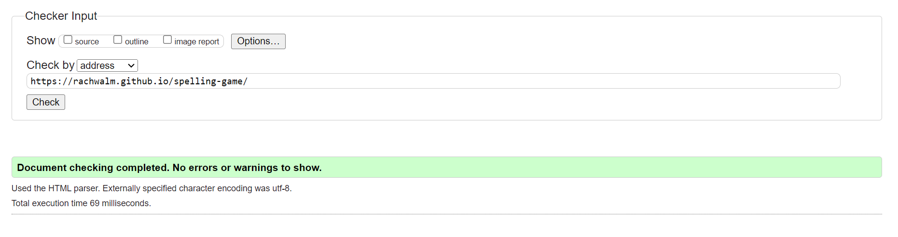
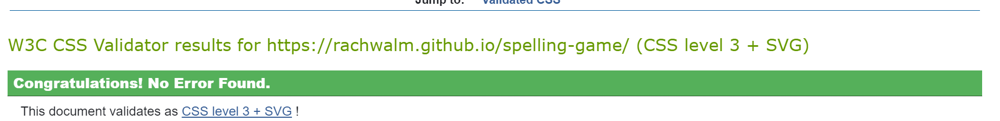
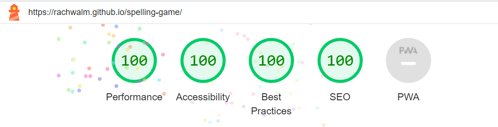

# Testing of Spelling game

## Use of intended audience to gain advice on how it should work

Prior to completing the coding, I asked children whether they could identify some of the images and what word they thought that they were being asked to spell. I also asked them what they would want in a game and what they wouldn't like. The responses from this decided against the timer idea and an easy word first as a tutorial was obviously needed. We made the hint optional and the give letter without it subtracting from the score was also discussed. The score concept was switched from per word to per letter.

The younger child liked getting a score per letter and the buy a letter function (although after starting to use this function just used that and raced through them). We discussed scores and they didn't like to have points taken off them for mistakes, buying letters or skipping words. They thought that it needed easy vs hard so that they didn't have to do the difficult words. I asked what they thought of a timer and they said it would be stressful.

The words the younger child couldn't identify from the picture and they didn't know were : pharaoh, quarter and incense. The pictures they chose a different word for were : dinosaur was T-rex, but when told that it was a longer word got dinosaur, and station was subway and they did get cucumber but also thought it might be a pickle. Due to their level of education I didn't ask them to try to spell any of the words that were longer than 3 letters, but they enjoyed that.

The younger child used the give letter continuously which means that they noticed that the screen instantly goes to the next word and you don't see the final letter.

As no one got incense from the picture and description, I have removed this word from the list.

The older child played very easily through the words (which at the time were mingled easy and hard) and said they understood what they were doing, especially after reading the instructions and having the 'fox' tutorial. The two words that they struggled with were incense and pharaoh (the 'oh' of pharaoh but could identify the picture). In general they enjoyed the game. Liking the scoring and not liking the idea of a timer(school/testing).

As adults have also had problems with incense this was removed from the list. Pharaoh will be kept and the hint improved - as the game needs to be challenging to get them to return.

## User stories testing

The site was played on chrome, firefox, edge and safari(on the ipad - which suffers from being an onscreen keyboard - looks like if each letter is pressed twice it works - maybe due to caps turning on for each input).

The final version was retested by the two children who had been testers once before during development, and had given their suggestions (with friends) at the beginning.

The main testing was done using chrome:

|level|first letter on/off|action|result|
|---|---|---|---|
|easy|off|run through just buying letter|as expected|
|easy|on|run through just buying letter|as expected|
|hard|off|run through just buying letter|as expected|
|hard|on|run through just buying letter|as expected|
|easy|off|run through just skipping|as expected|
|easy|on|run through just skipping||
|hard|off|run through just skipping||
|hard|on|run through just skipping||
|easy|off|run through correct letter||
|easy|on|run through correct letter||
|hard|off|run through correct letter||
|hard|on|run through correct letter||
|easy|off|Intermingle skip, buy, right and wrong||
|easy|on|Intermingle skip, buy, right and wrong||
|hard|off|Intermingle skip, buy, right and wrong||
|hard|on|Intermingle skip, buy, right and wrong||


- Checked hint for each word hidden and visible and relevant
- Checked image, word, description and letters correlated
- Checked restart at various points

## Validators and accessibility

### HTML



### CSS



### Javascript

The below was added to the javascript to aid with the validator.

```JS
/* jshint esversion: 8 */
```


### lighthouse




## Functions

All buttons checked to see if they did what was anticipated, which they did.

First round through checked for random order and skipped checked for random order. Both found to be different to other orders.

Instructions dialog box raised and closed by clicking button or outside of box. This worked.

The only issue that was found at any point during testing was if the person was using an onscreen keyboard, which appears to not be able to use the *onkeyup* and *onkeydown*. This is considered out of scope as the game was designed for a keyboard.

## Conclusion

This site met all of the requirements of the testing.